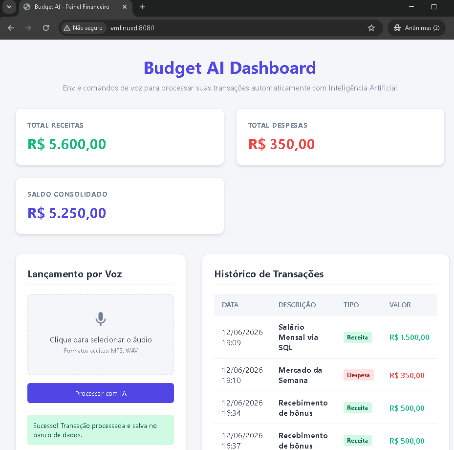
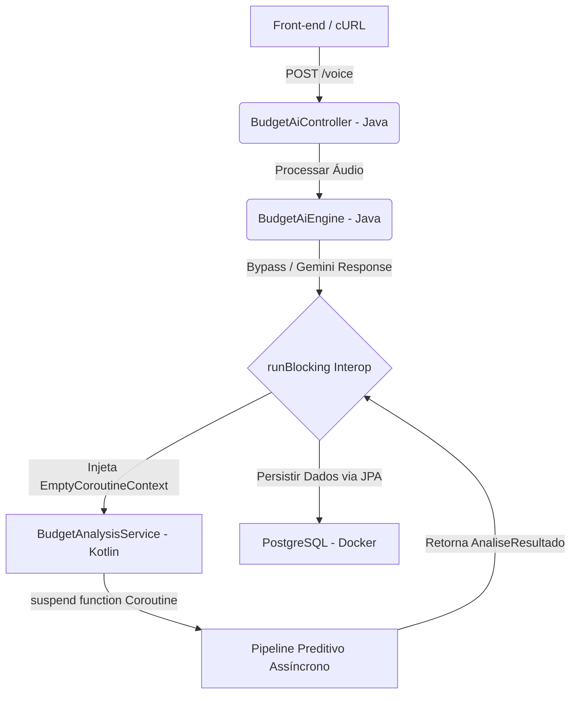

<!--
Tags: Fund, Dev, Skils, DevOps, DadosIA
Label: 🎙️ Blueprint de Desenvolvimento Orientado por IA: Budget AI API
Description: 🌟 Privado - API baseada em Arquitetura Hexagonal estrita e Java 21 para automação de transações financeiras pessoais via comandos de voz, integrada nativamente ao Google AI Studio (Gemini) e persistência em PostgreSQL estruturada via Docker.
technical_requirement: Java 21, Spring Boot 3.2.5, PostgreSQL, Docker, Docker Compose, Arquitetura Hexagonal (Ports & Adapters), Stream API, REST Client (RestTemplate), Multipart Files, Google AI Studio (Gemini API), Linux Terminal, Dotenv, Maven.
path_hook: hookfigma.hook9, hookfigma.hook7, hookfigma.hook13, hookfigma.hook6, hookfigma.hook1
-->

[](https://openjdk.org/projects/jdk/21/)
[](https://kotlinlang.org/)
[](https://spring.io/projects/spring-boot)



# Budget AI API

## Fluxo Blueprint de Desenvolvimento Orientado por IA

Você atuará como um Engenheiro de Software Sênior especialista em Java 21+, Spring Boot e Arquitetura Hexagonal (Ports & Adapters). Sua missão é construir e manter o projeto `budget-ai-api` seguindo estritamente as especificações de pacotes, dependências e acoplamento descritas neste documento.

## ⚖️ Premissas Críticas de Execução
1. **Isolamento de Frameworks:** A camada `domain` e as interfaces em `application` NÃO devem conter nenhuma anotação do Spring Framework ou Jakarta Persistence (`@Entity`, `@Id`, etc.).
2. **Arquitetura Hexagonal Estrita:** A persistência de dados real deve usar o padrão de mapeamento de infraestrutura (*TransactionEntity*), convertendo os dados de forma bidirecional para manter o Domínio 100% puro e isolado.
3. **Integração Multimodal Real:** As capacidades de IA devem ser executadas através de chamadas HTTP/REST reais para a API do Google AI Studio, enviando o binário do áudio em formato Base64.
4. **Estabilidade de Compilação:** Cada arquivo gerado deve conter todos os imports necessários. Não use pseudocódigo ou marcadores de omissão como `// restante do código aqui`.

---

## 🏗️ 1. Estrutura de Diretórios e Pacotes
```text
O projeto deve respeitar rigidamente a seguinte árvore sob a raiz `/home/userlnx/docker/script_docker/java-ia/budget-ai-api/`:

    budget-ai-api/
├── .env
├── .gitignore
├── ai-blueprint.md
├── docker-compose.yml
├── pom.xml
├── sftp-config.json
├── uploads/                        🆕 (Pasta física para armazenar os arquivos .mp3 de teste)
└── src/
    └── main/
        ├── java/
        │   └── dio/
        │       ├── BudgetAiApiApplication.java
        │       ├── MainSimulacao.java
        │       ├── application/
        │       │   ├── input/
        │       │   │   └── TransactionService.java
        │       │   └── output/
        │       │       └── TransactionRepository.java
        │       ├── domain/ 🆕 Camada de Alto Nível (Independente)
        │       │   ├── DashboardReport.java
        │       │   └── Transaction.java
        │       └── infrastructure/
        │           ├── BudgetAiController.java
        │           ├── BudgetAiEngine.java
        │           ├── RunnerTesteIa.java
        │           ├── SpringPostgresRepository.java
        │           ├── TransactionEntity.java
        │           ├── TransactionInMemoryAdapter.java
        │           └── TransactionPostgresAdapter.java
        ├── kotlin/                                 🆕 (Source Root para compilação do ecossistema Kotlin)
        │   └── dio/
        │       ├── domain/
        │       │   └── Transaction.kt
        │       └── infrastructure/
        │           └── BudgetAnalysisService.kt    🆕 (Serviço assíncrono preditivo usando Coroutines)
        └── resources/
            ├── application.properties
            └── static/             🆕 (Pasta correta para os arquivos do Front-end)
                └── index.html      🆕 (O seu painel do Dashboard em HTML/JS)
```

---

## 📦 2. Configurações de Ambiente (Build & Deploy)

### Arquivo: `pom.xml`
Gere um arquivo de configuração Maven estável utilizando as seguintes especificações:
- **Java Version:** 21 (compatível com execuções em Java 21).
- **Kotlin Version:** `1.9.23` (configurado com a propriedade `<kotlin.version>`).
- **Spring Boot Starter Parent:** `3.2.5`.
- **Dependências Core:** `spring-boot-starter-web`, `spring-boot-starter-data-jpa` e `spring-boot-starter-test` (escopo test).
- **Dependências Kotlin & Concorrência:** `kotlin-reflect`, `kotlin-stdlib` e `kotlinx-coroutines-core-jvm:1.7.3` para dar suporte a operações assíncronas não-bloqueantes.
- **Dependência de Banco de Dados:** `org.postgresql:postgresql` (escopo runtime).
- **Dependência de Ambiente:** `io.github.cdimascio:dotenv-java:3.0.0` para gerenciar o arquivo `.env`.
- **Plugins (Orquestração Híbrida):** - `kotlin-maven-plugin`: Configurado obrigatoriamente na fase `process-sources` para garantir que o **Kotlin compile ANTES do Java**.
  - `maven-compiler-plugin` (versão `3.11.0`): Configurado de forma coordenada com a fase posterior do ciclo de compilação do compilador Java.
  - `spring-boot-maven-plugin`.

### Arquivo: `docker-compose.yml`
Provisionamento automatizado do banco de dados relacional oficial. Deve subir um container baseado em `postgres:15-alpine`, nomeado como `budget-postgres`, expondo a porta `5432:5432`, mapeando as credenciais de ambiente locais (`POSTGRES_USER: userlnx`, `POSTGRES_PASSWORD: super_senha_123`, `POSTGRES_DB: budget_ai_db`) e isolando os dados através de um volume nomeado (`pgdata`).

### Arquivo: `sftp-config.json`
Configure um arquivo JSON de sincronização com o host `vmlinuxd`, porta `22`, usuário `userlnx`, senha `1234`. O caminho remoto deve ser `/home/userlnx/docker/script_docker/java-ia/budget-ai-api`. Configure a propriedade `upload_on_save` como falsa e ignore expressões regulares clássicas de IDEs como `.idea`, `target`, `uploads` e `.git`.

### Arquivo: `src/main/resources/application.properties`
Mapeie os parâmetros operacionais do Spring Boot e do ecossistema de banco de dados:
- Definição da porta servidora (`server.port=8080`).
- Captura de propriedade de sistema dinâmica para a chave da IA (`google.ai.studio.api.key=${GOOGLE_AI_KEY}`).
- Limites de tamanho de requisição multipart fixados em `10MB` para suportar arquivos de áudio binários.
- Driver de conexão apontando para `org.postgresql.Driver` utilizando a URL de conexão do container Docker: `jdbc:postgresql://localhost:5432/budget_ai_db`.
- Estratégia de DDL configurada como `update` para geração automática de tabelas a partir das entidades de infraestrutura, com logs de SQL ativos (`spring.jpa.show-sql=true`).

---

## 💻 3. Especificação de Código Fonte (Evoluídos por Casos de Uso)

### Passo 1: O Domínio Puro e Objetos de Valor
**Caminhos:** `src/main/java/dio/domain/Transaction.java` e `src/main/java/dio/domain/DashboardReport.java`
- **Transaction:** POJO encapsulando uma transação financeira. Contém `id` (Long), `description` (String), `amount` (BigDecimal), `type` (String: 'INCOME' ou 'EXPENSE'), e `createdAt` (LocalDateTime). Forneça construtores, getters/setters e `toString()`.
- **DashboardReport:** Um componente nativo do Java do tipo `record`. Responsável por transportar de forma imutável as métricas de agregação financeira: `totalIncome` (BigDecimal), `totalExpense` (BigDecimal) e `balance` (BigDecimal).

### Passo 2: A Porta de Saída
**Caminho:** `src/main/java/dio/application/output/TransactionRepository.java`
- Interface Java pura que assina o contrato abstrato de persistência para as transações:
  - `Transaction save(Transaction transaction);`
  - `List<Transaction> findAll();`

### Passo 3: O Caso de Uso (Core com Agregações via Stream API)
**Caminho:** `src/main/java/dio/application/input/TransactionService.java`
- Classe de serviço pura isolada do Spring. Recebe `TransactionRepository` via injeção por construtor.
- **criarTransacao(Transaction)**: Registra, loga a descrição e retorna a transação salva.
- **listarTodas()**: Recupera o histórico completo chamando a porta de saída.
- **obterRelatorioDashboard()**: Executa a lógica de negócios analítica. Consome todos os dados da porta de saída e utiliza a Stream API do Java com *Method References* (`Transaction::getAmount`) para filtrar, mapear e reduzir (`reduce`) os somatórios segregados por tipo, computando dinamicamente o saldo consolidado (`balance = totalIncome - totalExpense`).

### Passo 4: O Mapeamento de Banco e Interfaces JPA (Infraestrutura)
**Caminhos:** `src/main/java/dio/infrastructure/TransactionEntity.java` e `src/main/java/dio/infrastructure/SpringPostgresRepository.java`
- **TransactionEntity:** Modelo mapeado com anotações relacionais Jakarta (`@Entity`, `@Table(name = "tb_transactions")`, `@Id`, `@GeneratedValue`). Contém métodos estáticos de conversão bidirecional (`fromDomain` e `toDomain`) para manter a barreira arquitetural imposta pelo Domínio Puro.
- **SpringPostgresRepository:** Interface de infraestrutura que estende `JpaRepository<TransactionEntity, Long>`, concedendo acesso às transações nativas de persistência no PostgreSQL.

### Passo 5: O Adaptador do Banco de Dados Real (PostgreSQL)
**Caminho:** `src/main/java/dio/infrastructure/TransactionPostgresAdapter.java`
- Classe anotada com `@Component` e demarcada com `@Primary` para assume a precedência de injeção sobre adaptadores temporários em memória. Implementa a porta de saída `TransactionRepository`.
- Orquestra as conversões de tipo mapeando as operações recebidas para `TransactionEntity`, persistindo-as através do `SpringPostgresRepository` e devolvendo objetos puros de domínio nas saídas das operações de persistência e listagem.

### Passo 5.1: Modelo de Dados de Interoperabilidade Kotlin-Java (Infraestrutura)
**Caminho:** `src/main/kotlin/dio/infrastructure/AnaliseResultado.kt`
- Defina uma `data class` em Kotlin para transporte limpo de dados contendo as propriedades `categoria` (String) e `insightIA` (String). Essa classe será consumida nativamente pelo compilador Java como um POJO clássico.

### Passo 5.2: O Serviço de Análise Preditiva e Concorrência Não-Bloqueante
**Caminho:** `src/main/kotlin/dio/infrastructure/BudgetAnalysisService.kt`
- Classe anotada com `@Service` ou `@Component` do Spring, desenvolvida em Kotlin.
- Deve expor uma função marcada com a palavra-chave **`suspend`**: `processarAnalisePreditiva(description: String, amount: BigDecimal): AnaliseResultado`.
- Utilize o escopo de concorrência (`coroutineScope`, `async/await`) para simular ou processar regras preditivas de risco, análise de categorias inteligente com base na descrição informada e tratamento de concorrência leve, devolvendo uma instância de `AnaliseResultado`.

### Passo 6: O Motor de Conexão com Google AI Studio e Orquestrador Híbrido
**Caminho:** `src/main/java/dio/infrastructure/BudgetAiEngine.java`
- Classe anotada com `@Component`. Envia o arquivo de áudio local convertido em **Base64** em um payload REST estruturado para a API do Gemini via `RestTemplate`.
- **Injeção de Dependência:** Deve receber no construtor único tanto o `TransactionService` (Core/Java) quanto o `BudgetAnalysisService` (Infra/Kotlin).
- **executarToolCalling(String)**: Limpa marcações markdown e intercepta o fluxo antes de salvar. Aciona a ponte de interoperabilidade da JVM utilizando o executor de bloqueio seguro de threads do ecossistema do Kotlin: kotlinx.coroutines.BuildersKt.runBlocking. Passa obrigatoriamente o EmptyCoroutineContext.INSTANCE no primeiro parâmetro para blindar o interop e transfere os parâmetros extraídos da LLM para a coroutine suspensa do Kotlin, captura o objeto AnaliseResultado gerado, adota fallbacks inteligentes baseados em Null Safety caso a descrição venha nula, e transfere a entidade limpa e higienizada para a persistência definitiva no Core.

### Passo 7: O Inicializador do Container e Injeção de Ambiente (.env)
**Caminho:** `src/main/java/dio/BudgetAiApiApplication.java`
- Classe de inicialização padrão do Spring Boot anotada com `@SpringBootApplication`.
- No método `main`, antes do bootstrap do Spring, inicialize o leitor `Dotenv.configure().ignoreIfMissing().load()`. Transfira todas as variáveis carregadas do arquivo `.env` para as propriedades de sistema do Java (`System.setProperty`) de forma iterativa.
- Forneça um método explícito anotado com `@Bean` para instanciar manualmente o `TransactionService`, injetando a implementação do repositório gerenciada pelo Spring para manter o desacoplamento de frameworks no Core.

### Passo 8: O Adaptador de Entrada Web (Controlador REST com Painel)
**Caminho:** `src/main/java/dio/infrastructure/BudgetAiController.java`
- Controlador `@RestController` mapeando a rota base `/api/budget`.
- **POST `/voice`**: Processa uploads via `MultipartFile`, salvando os arquivos físicos na pasta local `/uploads/` e disparando o motor de IA.
- **GET `/transactions`**: Expõe a listagem pura das transações salvas.
- **GET `/dashboard`**: Expõe os dados consolidados analíticos obtidos através da chamada do caso de uso `transactionService.obterRelatorioDashboard()`.

### Passo 9: Classe de Simulação Alternativa
**Caminho:** `src/main/java/dio/MainSimulacao.java`
- Crie uma classe Java com um método `main` puro para permitir testes manuais via inversão de dependência clássica, instanciando o `TransactionInMemoryAdapter` e acoplando-o diretamente ao `TransactionService` sem subir o ecossistema Spring.

---

## 🛑 4. Protocolo de Validação e Testes em Produção

Ao finalizar a execução das classes, garanta que os seguintes comportamentos sejam validados:

1. **Subida do Ambiente de Dados (Docker):**
   Comando: `docker compose up -d`. O container do PostgreSQL deve constar como ativo e mapear o volume de armazenamento permanente com sucesso.

2. **Compilação e Bootstrap da API:**
   Comando: `mvn clean spring-boot:run`. O console deve registrar o binding do pool Hikari com o PostgreSQL e exibir a instrução SQL DDL executada pelo Hibernate: `create table tb_transactions (...)`.

3. **Validação do Painel Consolidado via cURL:**
   Execute a chamada HTTP para verificar a agregação dinâmica em tempo real:
   
```bash
    curl -X GET http://localhost:8080/api/budget/dashboard
      *Retorno esperado:* Um payload JSON contendo as chaves numéricas estruturadas e computadas pela Stream API:
       {"totalIncome":500.00,"totalExpense":0,"balance":500.00}

    curl -X POST -F "file=@uploads/audio_real_50.mp3" "http://localhost:8080/api/budget/voice"
      *Retorno esperado:* Uma string contendo respostas computadas pela Stream API:
        Sucesso! Áudio interpretado pelo Google AI Studio e registrado. ID: 4 | Tipo: INCOMEuserlnx@vmlinuxd:~/docker/script_docker/java-ia/budget-ai-api$ 

    espeak -v pt-br "Gastei 50 reais de almoço hoje" -w uploads/teste.wav && lame -V2 uploads/teste.wav uploads/audio_real_50.mp3 && rm teste.wav
      *Retorno esperado:* um audio mp3 com o texto informado

   kill -9 $(lsof -t -i:8080)
   kill -9 $(lsof -t -i:8080) #Encerra à força processos travados na porta 8080 para evitar o erro Address already in use.
   export $(cat .env | xargs) && mvn spring-boot:run #Carrega as chaves secretas do arquivo .env diretamente para o escopo de execução do Maven
   export $(cat .env | xargs) && mvn spring-boot:run -Dspring-boot.run.jvmArguments="-Djava.net.preferIPv4Stack=true" #Forçamento de Pilha IPv4 (Correção de Conectividade)
   export $(cat .env | xargs) && mvn clean spring-boot:run -Dspring-boot.run.jvmArguments="-Djava.net.preferIPv4Stack=true" #icialização Limpa e Recompilação Total (Build Seguro)
```
4. **Para o Gemini funcionar adicione:**
```bash
nano /etc/resolv.conf
nameserver 8.8.8.8
nameserver 8.8.4.4

```

# Fluxo explicativo (para humanos)

Para demonstrar os padrões de resiliência e concorrência exigidos em ambientes corporativos, o componente BudgetAnalysisService foi implementado em Kotlin para introduzir conceitos avançados de computação assíncrona paralela:

### 1. Concorrência Não-Bloqueante de Alta Performance (Coroutines)
A orquestração do pipeline preditivo e classificação de risco foi desenhada usando Kotlin Coroutines através da ponte de interoperabilidade runBlocking integrada à JVM:
* Suspensão de Threads (suspend): Durante o tempo de espera de processamento das rotinas de inteligência, as Threads do Tomcat (Java) não são bloqueadas. Elas são liberadas para atender outras requisições HTTP no dashboard, otimizando o throughput do servidor.
* Mecanismo Continuation-Passing Style (CPS): O Java invoca o serviço em Kotlin passando um objeto Continuation (sob o capô), que funciona como um callback de baixíssimo nível controlado pela JVM para retomar o fluxo assim que a análise assíncrona terminar.

### 2. Sistema de Tipos & Resiliência (Null Safety)
Manipular payloads voláteis vindos de motores de IA e áudio é um desafio para a estabilidade do sistema. O módulo Kotlin blinda o Core da aplicação contra o temido NullPointerException:
* Uso estrito de tipos anuláveis (BigDecimal?, String?).
* Tratamento defensivo via Elvis Operator (?:) para garantir fallbacks seguros e dados sanitizados antes que o registro seja entregue ao JPA/Hibernate para persistência no PostgreSQL.

---

## ⚙️ Fluxo de Execução Híbrido

